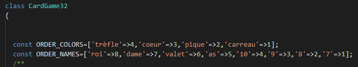

# Guess What

Prérequis : bases de la programmation, PHP 7 ou supérieur installé sur votre machine de dev.

## Objectif

* Conception et mise au point de la logique applicative avec PHP Unit

* Structure de données, recherche d'un élément dans une liste

* Analyse des actions du joueur (fonction du nombre de cartes, aides à la décision)  

  

### Lien GitHub et GitLab

Liens du projet d'origine: https://gitlab.com/okpu/guesswhat
Liens du projet personnelle hébergée sur GitHub : https://github.com/BGuiIlot/Guess

#### Présentations du projet

**Challenge 1 :** 

Vérification de la version PHP et composer avant de démarrer le projet .

Installations de Composer dans le projet Guess What avec la commande: composer install

ensuite update de composer pour éviter les problèmes de version avec la commande : composer update

ensuite installation du plugin PHP Unit et indications de sa version pour permettre de réaliser les tests : php ./bin/phpunit --version

et lancement du premier test et apprentissage des tests unitaires

**Challenge 2 :** 

Ensuite nous devons réalisez les tests unitaire pour qu'il soit correct donc pour faire cela j'ai premièrement ajoutez un nom et une couleurs aux cartes ainsi qu'un ordre comme si dessous : 

ensuite j'ai réalisez les tests la plupart ne mon pas posez de problèmes à par la fonction ToString :

Mais j'ai réussie à me débrouillez sans crée de fonction dans CardGame32.php et à le faire fonctionnez directement dans la fonction CardTest.php ci-dessus.

et pour savoir quel était la fonction qui ne fonctionnait pas j'ai utilisez la commande: php ./bin/phpunit .\tests\Core\CardTest.php --filter testToString

La page CardTest.php complète sans failure :

**Challenge 3 :** 

Au début j'ai réalisez des tests avec un format dur du deck de 32 cartes et les tests ci-dessous fonctionnait :

Mais j'ai voulus réaliser un tableau des cartes avec leurs couleurs mais ceci me créait des erreurs comme vous le voyez :

 

A cause de ceci j'ai pris du retard et mon projet c'est arrêtez ici les seules autre fonctions que j'ai réalisez sont cela :

Merci d'avoir pris le temp de lire ce rapport malgré le peu de contenue.
